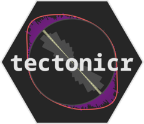
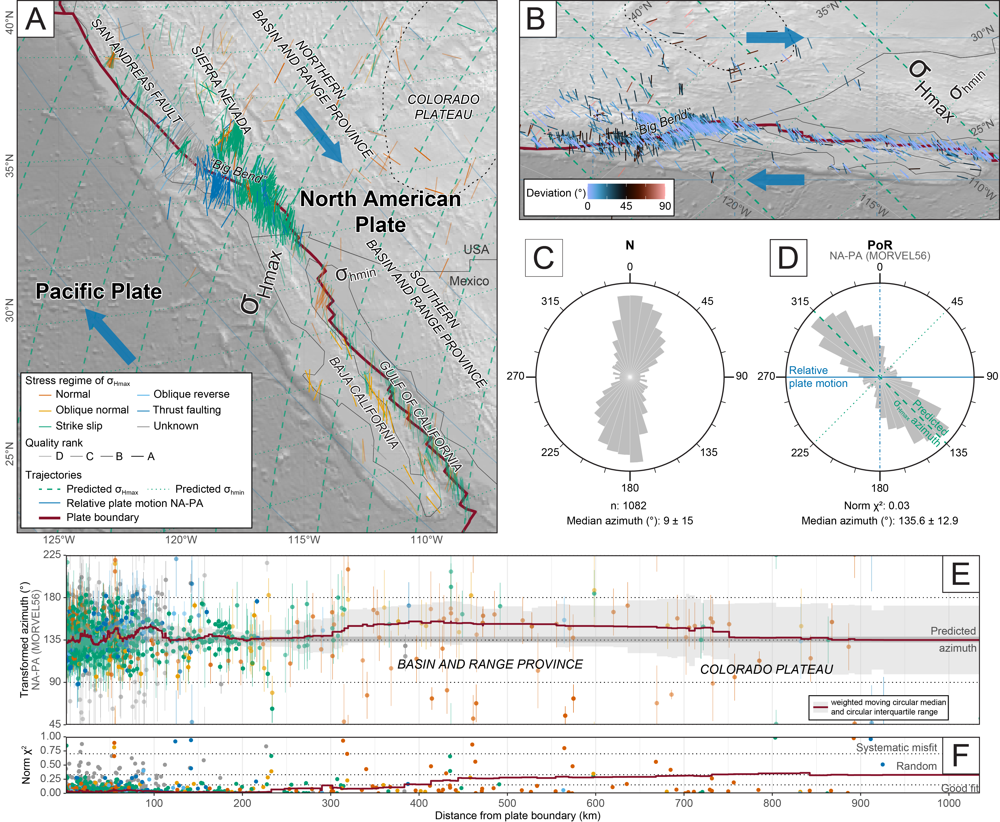

# tectonicr <a href="https://cran.r-project.org/package=tectonicr/"></a>

<!-- badges: start -->

[](https://CRAN.R-project.org/package=tectonicr)
[](https://github.com/tobiste/tectonicr)
[](https://cran.r-project.org/package=tectonicr)
[](https://github.com/tobiste/tectonicr/actions/workflows/R-CMD-check.yaml)
[](https://doi.org/10.32614/CRAN.package.tectonicr)
[](http://www.gnu.org/licenses/gpl-3.0)
<!-- [](https://doi.org/10.5281/zenodo.11199557) -->

<!-- badges: end -->

`tectonicr` is a free and open-source **R** package for modeling and
analyzing the direction of the maximum horizontal stress (SHmax) based
on the empirical link between the direction of intraplate stress and the
direction of the relative motion of neighboring plates (Wdowinski, 1998;
Stephan et al., 2023). The following methods are available:

-   **Direction of the plate boundary forces**: `PoR_shmax()` gives the
    predicted stress field adjacent to a plate boundary, calculated
    using the relative plate motion of the neighboring plates using the
    function `model_shmax()`. The goodness-of-fit can be statistically
    tested by e.g. `norm_chisq()`, `circular_dispersion()`
    ,`rayleigh_test()`, and `confidence_interval()`.
-   **Distance to plate boundary**: `distance_from_pb()` gives the
    distance between the stress data point and the plate boundary
    measured along the stress trajectories.
-   **Trajectories of the theoretical stress field** `eulerpole_paths()`
    generates an `sf` object containing spatial information that is
    suitable to plot with, for instance, `ggplot()`.
-   **Relative rotations from a given set of plate motion parameters**:
    `equivalent_rotation()` transfers a set of plate motion parameters
    into the relative plate motions among the given plates.
-   **Average direction and variance of a set of SHmax data** using
    (weighted) statistics and other parameters to statistically estimate
    the distribution parameters of pi-directional data.
-   **Spatial interpolation of of SHmax**: `PoR_stress2grid()` uses
    distance, method, and quality-weighted mean direction of stress data
    without being affected by angular distortions.
-   **Rose plot** `rose()` shows the frequencies of the orientations in
    polar coordinates
-   **Stress anomaly map**: spatial distribution of the dispersion of
    the observed stress field from the directions of plate boundary
    forces
-   **Download and filter world stress map data** using
    `download_WSM2016()`

## Prerequisites

You must have R installed on your system (see <http://r-project.org>).
To install `tectonicr` from CRAN, type the following code at the R
command line prompt:

```         
install.packages("tectonicr")
```

## Installation

The most recent development version of `tectonicr` is available from
Github and can be installed on your system as follows:

```         
# install.packages("remotes") # install if needed
remotes::install_github('tobiste/tectonicr')
library('tectonicr')
```

Using the stress measurements from the San Andreas Fault - Gulf of
California example, a quick analysis and test against the right-lateral
transform plate boundary can be achieved by:

```         
# load example data
data(san_andreas)
data(nuvel1)
data(plates)

stress_analysis(
san_andreas, 
PoR = equivalent_rotation(nuvel1, "na", "pa"), 
type = "right", 
pb = subset(plates, pair == "na-pa")
)
```

The code produces the underlying results for Fig. 7 from Stephan et al.
(2023)



## Documentation

The detailed documentation can be found at
<https://tobiste.github.io/tectonicr/articles/tectonicr.html>

## GUI

There is a graphical user interface that provides some (limited)
tectonicr functionalities. No need to install, just click on the link
and you can run tectonicr on your browser:

<https://tobiste.shinyapps.io/tectonicr-app/>

## Author

Tobias Stephan
([tstephan\@lakeheadu.ca](mailto:tstephan@lakeheadu.ca){.email})

## Feedback, issues, and contributions

I welcome feedback, suggestions, issues, and contributions! If you have
found a bug, please file it
[here](https://github.com/tobiste/tectonicr/issues) with minimal code to
reproduce the issue.

## How to cite tectonicr

When referencing this package, please cite

Stephan, T., Enkelmann, E., and Kroner, U. (2023). Analyzing the
horizontal orientation of the crustal stress adjacent to plate
boundaries. *Scientific Reports*, *13*(1). DOI:
[10.1038/s41598-023-42433-2](https://doi.org/10.1038/s41598-023-42433-2).

and the package DOI:
[10.32614/CRAN.package.tectonicr](https://doi.org/10.32614/CRAN.package.tectonicr).

## License

GPL-3.0 License
