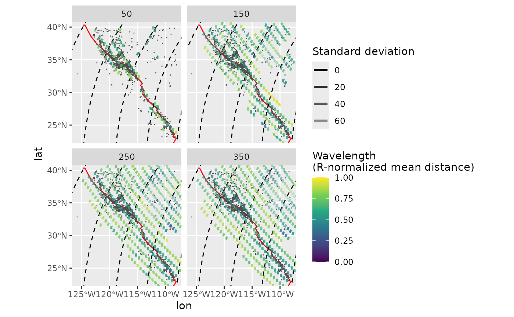
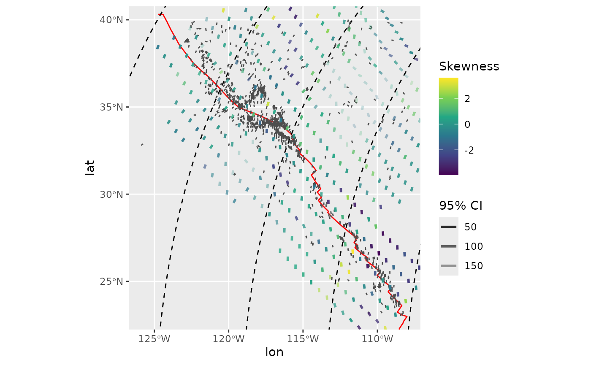
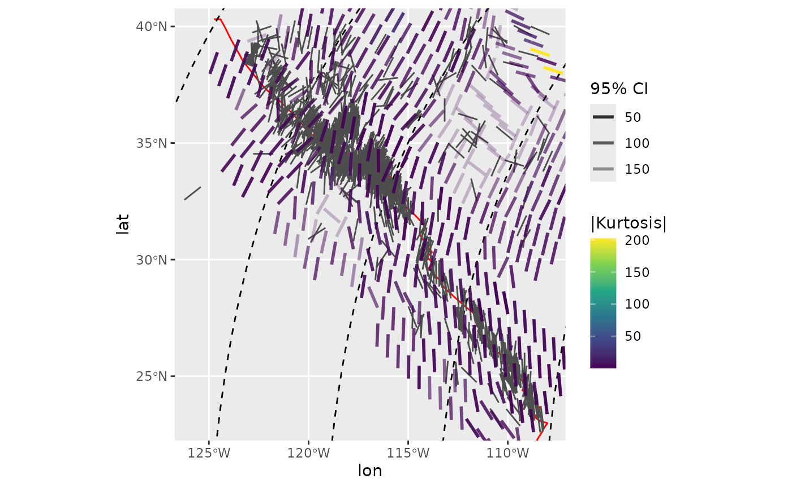
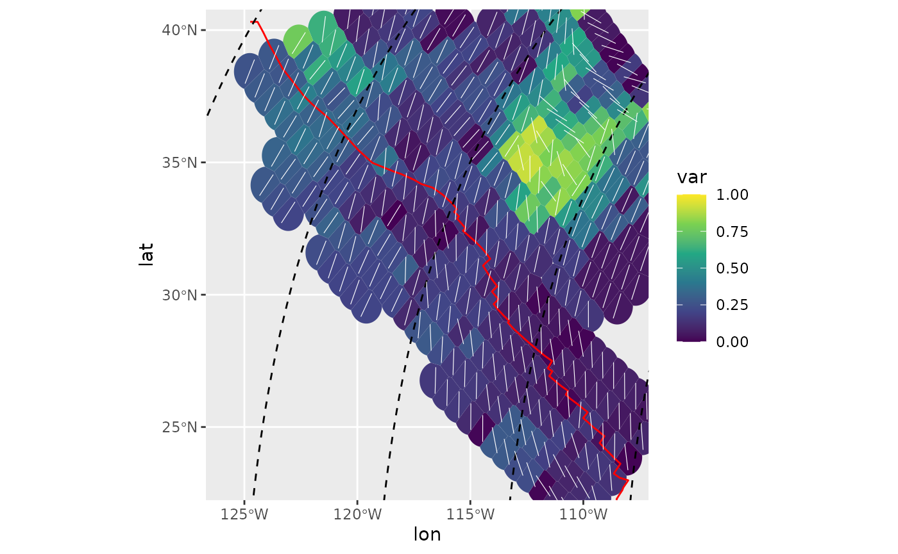
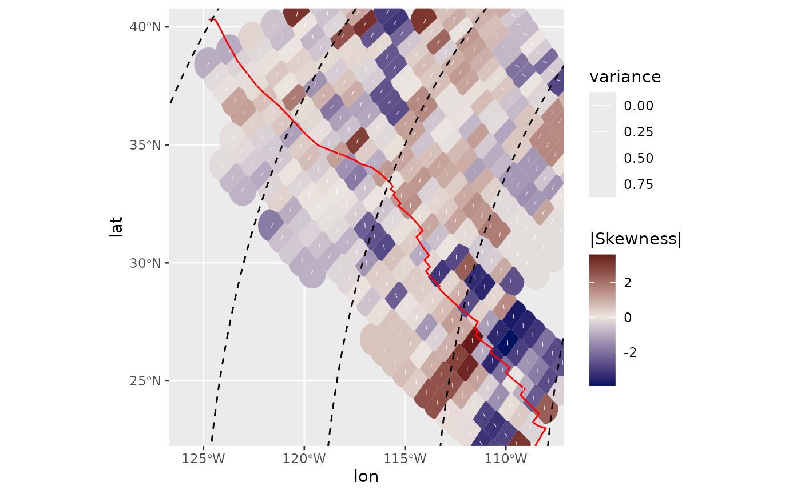
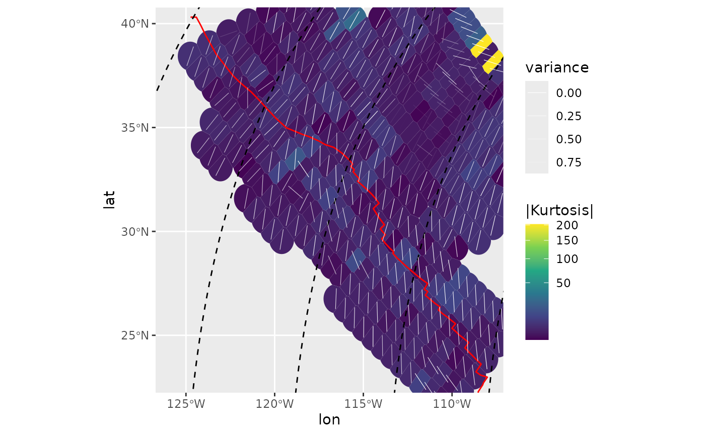
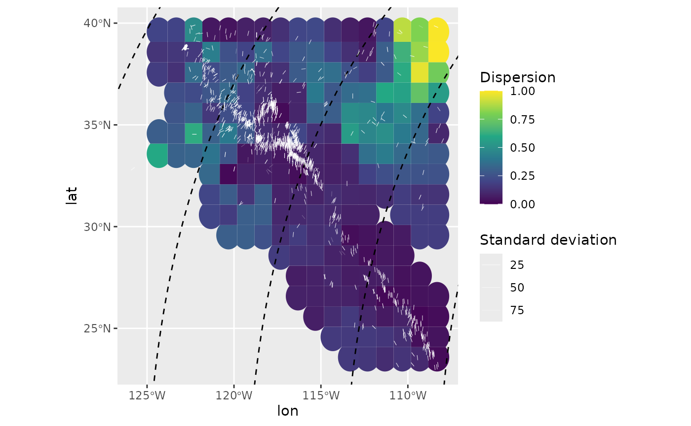

# Spatial Analysis

This vignette demonstrates some additional spatially interpolated
statistics of a stress field.

``` r
library(tectonicr)
library(ggplot2) # load ggplot library
```

``` r
data("san_andreas")

data("cpm_models")
por <- cpm_models[["NNR-MORVEL56"]] |>
  equivalent_rotation("na", "pa")

plate_boundary <- subset(plates, plates$pair == "na-pa")
```

[`circular_summary()`](https://tobiste.github.io/tectonicr/reference/circular_summary.md)
yields several statistics estimates for a given vector of angles, such
as mean, median, standard deviation, quasi-quantiles, mode, 95%
confidence angle, as wells as the moments (, i.e. 2nd moment = variance,
3rd = skewness, 4th = kurtosis):

``` r
circular_summary(san_andreas$azi, w = weighting(san_andreas$unc))
#>            n         mean           sd          var          25% quasi-median 
#> 1126.0000000   10.8538228   23.8438493    0.2927477   15.0000000   35.5357179 
#>          75%       median           CI     skewness     kurtosis            R 
#>  160.0000000    9.0000000    5.7737140   -0.2710770    1.1239222    0.7072523
```

## Spatial analysis

Spatial analysis and interpolation of stress data using
[`stress2grid_stats()`](https://tobiste.github.io/tectonicr/reference/stress2grid.md)
or
[`PoR_stress2grid_stats()`](https://tobiste.github.io/tectonicr/reference/PoR_stress2grid.md)
(analysis in the PoR coordinate system) uses a moving window with a user
defined cell-size (im km) and calculates the summary statistics within
each cell:

``` r
spatial_stats_R <- PoR_stress2grid_stats(san_andreas, PoR = por, gridsize = 1, R_range = 100)
subset(spatial_stats_R, !is.na(mean)) |> head()
#> Simple feature collection with 6 features and 23 fields
#> Geometry type: POINT
#> Dimension:     XY
#> Bounding box:  xmin: -110.8569 ymin: 34.99224 xmax: -107.9222 ymax: 39.97615
#> Geodetic CRS:  WGS 84
#>     lon.PoR   lat.PoR  mean.PoR       sd       var   25%.PoR quasi-median.PoR
#> 24 84.83339 -61.15394  62.49110 34.19146 0.5094509  45.83768         70.68846
#> 25 85.83339 -61.15394  79.28662 37.82152 0.5816725  70.68846         70.68846
#> 26 86.83339 -61.15394 112.88278 55.51173 0.8470109  53.79210         90.72089
#> 35 75.83339 -60.15394 146.61405 24.94924 0.3156098 148.14101        150.90749
#> 42 82.83339 -60.15394  71.36347 18.55806 0.1892709  67.77922         73.54519
#> 43 83.83339 -60.15394  80.79428 24.57849 0.3079105  49.43459         76.92189
#>      75%.PoR median.PoR        CI   skewness   kurtosis     meanR   R N
#> 24  70.68846   70.68846 180.00000 -1.7582271  1.3664213 0.4905491 100 5
#> 25 127.81138   80.70468 180.00000 -1.6526557 -1.5511149 0.4183275 100 4
#> 26 127.81138   90.72089 180.00000  0.7532090 -0.8523197 0.1529891 100 5
#> 35 157.91252  151.01426 142.32537  2.0902540  2.8515751 0.6843902 100 4
#> 42  95.51644   72.35056  76.92846  0.5162450 -1.9988085 0.8107291 100 4
#> 43  80.57092   76.92189  94.92920  0.1517067 -1.6394874 0.6920895 100 5
#>          mdr                   geometry      lat       lon      mean       25%
#> 24 0.6719937 POINT (-110.1257 39.15542) 39.15542 -110.1257 120.10119 103.44777
#> 25 0.1758576 POINT (-110.4569 39.56431) 39.56431 -110.4569 137.56260 128.96443
#> 26 0.6370203 POINT (-110.7839 39.97615) 39.97615 -110.7839 171.82553 112.73485
#> 35 0.6239140 POINT (-107.9222 34.99224) 34.99224 -107.9222  17.70425  19.23121
#> 42 0.6932675 POINT (-110.5034 37.78685) 37.78685 -110.5034 126.99513 123.41089
#> 43 0.6433647 POINT (-110.8569 38.19922) 38.19922 -110.8569 137.07570 105.71601
#>    quasi-median        75%    median
#> 24    128.29855 128.298547 128.29855
#> 25    128.96443   6.087356 138.98065
#> 26    149.66364   6.754129 149.66364
#> 35     21.99769  29.002725  22.10446
#> 42    129.17685 151.148106 127.98222
#> 43    133.20331 136.852339 133.20331
```

One can also specify a range of cell-sizes for a wavelength analysis:

``` r
spatial_stats <- PoR_stress2grid_stats(san_andreas, PoR = por, gridsize = 1, R_range = seq(50, 350, 100), mode = TRUE)
```

The mean azimuth for each grid cell:

``` r
trajectories <- eulerpole_loxodromes(x = por, n = 40, cw = FALSE)

ggplot(spatial_stats) +
  geom_sf(data = plate_boundary, color = "red") +
  geom_sf(data = trajectories, lty = 2) +
  geom_azimuth(data = san_andreas, aes(lon, lat, angle = azi), radius = .17, linewidth = .5, color = "grey30") +
  geom_azimuth(aes(lon, lat, angle = mean, alpha = sd, color = mdr), radius = .5, lwd = 1) +
  coord_sf(xlim = range(san_andreas$lon), ylim = range(san_andreas$lat)) +
  scale_alpha(name = "Standard deviation", range = c(1, .25)) +
  scale_color_viridis_c(
    "Wavelength\n(R-normalized mean distance)",
    limits = c(0, 1),
    breaks = seq(0, 1, .25)
  ) +
  facet_wrap(~R)
```



To filter the range of search windows to only keep the shortest
wavelength (R) with the least variance for each grid cell, use
[`compact_grid2()`](https://tobiste.github.io/tectonicr/reference/compact-grid.md).

``` r
spatial_stats_comp <- spatial_stats |>
  compact_grid2(var)
```

Interpolated median stress field color-coded by the skewness within each
search window:

``` r
ggplot(spatial_stats_comp) +
  geom_sf(data = plate_boundary, color = "red") +
  geom_sf(data = trajectories, lty = 2) +
  geom_azimuth(data = san_andreas, aes(lon, lat, angle = azi), radius = .15, color = "grey30") +
  geom_azimuth(aes(lon, lat, angle = median, alpha = CI, color = skewness), radius = .25, lwd = 1) +
  coord_sf(xlim = range(san_andreas$lon), ylim = range(san_andreas$lat)) +
  scale_alpha(name = "95% CI", range = c(1, .25)) +
  scale_color_viridis_c(
    "Skewness"
  )
```



Interpolated mode of the stress field color-coded by the absolute
kurtosis within each search window:

``` r
ggplot(spatial_stats_comp) +
  geom_sf(data = plate_boundary, color = "red") +
  geom_sf(data = trajectories, lty = 2) +
  geom_azimuth(data = san_andreas, aes(lon, lat, angle = azi), radius = .15, color = "grey30") +
  geom_azimuth(aes(lon, lat, angle = mode, alpha = CI, color = abs(kurtosis)), radius = .25, lwd = 1) +
  coord_sf(xlim = range(san_andreas$lon), ylim = range(san_andreas$lat)) +
  scale_alpha(name = "95% CI", range = c(1, .25)) +
  scale_color_viridis_c(
    "|Kurtosis|"
  )
```



## Heat maps for the spatial statistics

[`PoR_stress2grid_stats()`](https://tobiste.github.io/tectonicr/reference/PoR_stress2grid.md)
and
[`stress2grid_stats()`](https://tobiste.github.io/tectonicr/reference/stress2grid.md)
allow to create heatmaps showing the spatial patterns of any desired
statistical estimate (from
[`circular_summary()`](https://tobiste.github.io/tectonicr/reference/circular_summary.md)).
Some examples:

### Spatial central moments

#### Spatial variance

``` r
ggplot(spatial_stats_comp) +
  ggforce::geom_voronoi_tile(
    aes(lon, lat, fill = var),
    max.radius = .7, normalize = FALSE
  ) +
  scale_fill_viridis_c(limits = c(0, 1)) +
  geom_sf(data = plate_boundary, color = "red") +
  geom_sf(data = trajectories, lty = 2) +
  geom_azimuth(
    aes(lon, lat, angle = mean),
    radius = .25, lwd = .2, colour = "white"
  ) +
  coord_sf(xlim = range(san_andreas$lon), ylim = range(san_andreas$lat))
```



#### Skewness:

Skewness is a measure for the asymmetry of the probability distribution.
It can be either counterclockwise or clockwise skewed, hence values can
range between negative and positive numbers, respectively. This can be
best visualized in a diverging color-sequence:

``` r
ggplot(spatial_stats_comp) +
  ggforce::geom_voronoi_tile(
    aes(lon, lat, fill = skewness),
    max.radius = .7, normalize = FALSE
  ) +
  scale_fill_gradient2("|Skewness|", low = "#001260", mid = "#EBE5E0", high = "#590007") +
  geom_sf(data = plate_boundary, color = "red") +
  geom_sf(data = trajectories, lty = 2) +
  geom_azimuth(
    aes(lon, lat, angle = median, alpha = var),
    radius = .2, lwd = .2, colour = "white"
  ) +
  scale_alpha("variance", range = c(1, 0)) +
  coord_sf(xlim = range(san_andreas$lon), ylim = range(san_andreas$lat))
```



#### Kurtosis

Kurtosis is a measure of the “tailedness” of the probability
distribution. Here, colors are in a square-root scale:

``` r
ggplot(spatial_stats_comp) +
  ggforce::geom_voronoi_tile(
    aes(lon, lat, fill = abs(kurtosis)),
    max.radius = .7, normalize = FALSE
  ) +
  scale_fill_viridis_c("|Kurtosis|", transform = "sqrt") +
  geom_sf(data = plate_boundary, color = "red") +
  geom_sf(data = trajectories, lty = 2) +
  geom_azimuth(
    aes(lon, lat, angle = mode, alpha = var),
    radius = .25, lwd = .2, colour = "white"
  ) +
  scale_alpha("variance", range = c(1, 0)) +
  coord_sf(xlim = range(san_andreas$lon), ylim = range(san_andreas$lat))
```



### Kernel dispersion

Another way to analyse spatial misfits is the kernel dispersion,
i.e. the local dispersion within a user-defined window (kernel). The
kernel´s half width can be a single number (km) or a range of widths.
The latter requires to compact the grid result (`x`) to find the
smallest kernel size containing the the least dispersion
(`compact_grid(x, 'dispersion')`).

> It is recommended to calculate the kernel dispersion on PoR
> transformed data to avoid angle distortions due to projections.

``` r
san_andreas_por <- san_andreas
san_andreas_por$azi <- PoR_shmax(san_andreas, por, "right")$azi.PoR # transform to PoR azimuth
san_andreas_por$prd <- 135 # test direction
san_andreas_kdisp <- kernel_dispersion(san_andreas_por, gridsize = 1, R_range = seq(50, 350, 100))
san_andreas_kdisp <- compact_grid(san_andreas_kdisp, "dispersion")

ggplot(san_andreas_kdisp) +
  ggforce::geom_voronoi_tile(
    aes(lon, lat, fill = stat),
    max.radius = .7, normalize = FALSE
  ) +
  scale_fill_viridis_c("Dispersion", limits = c(0, 1)) +
  geom_sf(data = trajectories, lty = 2) +
  geom_azimuth(
    data = san_andreas,
    aes(lon, lat, angle = azi, alpha = unc),
    radius = .25, lwd = .2, colour = "white"
  ) +
  scale_alpha("Standard deviation", range = c(1, .25)) +
  coord_sf(xlim = range(san_andreas$lon), ylim = range(san_andreas$lat))
```


