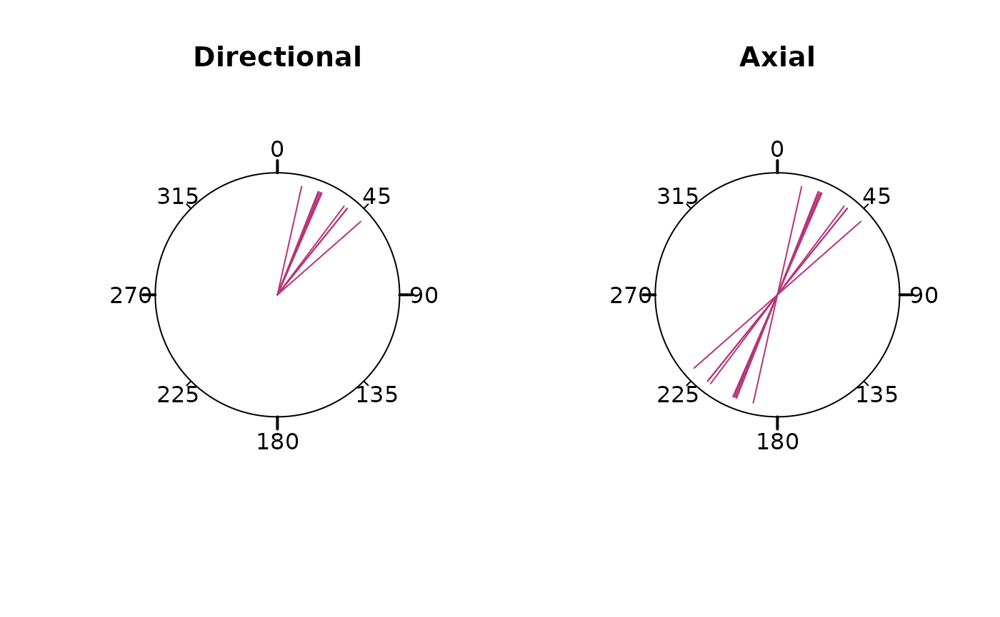

# Circular statistics

This vignette teaches you how to retrieve statistical parameters of
orientation data, for example the mean direction of stress datasets.

``` r
library(tectonicr)
library(ggplot2) # load ggplot library
```

### Orientation data types

Circular orientation data are two-dimensional orientation vectors that
are either **directional** or **axial**.

- **Directional** data are $2\pi$-periodical, the angle $\alpha$ is
  non-symmetrical on a circle. The modulus of the angle is $2\pi$
  (360°): α = α mod $2\pi$. Directional data usually involve processes
  where objects or particles were transported from one known place to
  another. Examples are wind direction, bird vanishing angles, plate
  motion, and fault slip directions.
- **Axial** data are $\pi$-periodical, i.e. each direction is considered
  as equivalent to the opposite direction, so that the angles $\alpha$
  and $\alpha + 180^{\circ}$ are equivalent. The modulus of the angle is
  $\pi$ (180°): α = α mod $\pi$. Data usually involves transport of
  objects where the origin is unknown or doesn’t matter as the transport
  could be extended infinitely. Examples are glacial striae, mineral
  alignments (long-axis of grain or crystal shapes), and principal
  stress/strain axes (e.g. shortening or compression direction,
  including the angle of the maximum horizontal stress
  $\sigma_{\text{Hmax}}$).

> In (almost) every function in the **tectonicr** library, the `axial`
> argument specifies whether your angles `x` are axial (`TRUE`) or
> directional (`FALSE`). Because this package is mainly designed for
> analyzing stress orientations, the default is `axial=TRUE`.

``` r
angles <- rvm(10, mean = 35, kappa = 20)

par(mfrow = c(1, 2), xpd = NA)
circular_plot(main = "Directional")
rose_line(angles, axial = FALSE, col = "#B63679FF")

circular_plot(main = "Axial")
rose_line(angles, axial = TRUE, col = "#B63679FF")
```



### Mean direction

In case of axial data, the calculation of the mean of, say, of
35$^{\circ}$ and 355$^{\circ}$ should be 15 instead of 195$^{\circ}$.
**tectonicr** provides the circular mean
([`circular_mean()`](https://tobiste.github.io/tectonicr/reference/circle_stats.md))
and the quasi-median
([`circular_median()`](https://tobiste.github.io/tectonicr/reference/circle_stats.md))
as metrics to describe average direction:

``` r
data("san_andreas")
circular_mean(san_andreas$azi)
#> [1] 10.64134
circular_median(san_andreas$azi)
#> [1] 35.5
```

> Again: if your angles are directional, you need to specify the `axial`
> argument.

Note the different results:

``` r
circular_mean(san_andreas$azi, axial = FALSE)
#> [1] 53.66556
circular_median(san_andreas$azi, axial = FALSE)
#> [1] 36.5
```

### Quality weighted mean direction

Because the stress data is heteroscedastic, the data with less precise
direction should have less impact on the final mean direction The
weighted mean or quasi-median uses the reported measurements linear
weighted by the inverse of the uncertainties:

``` r
w <- weighting(san_andreas$unc)

circular_mean(san_andreas$azi, w)
#> [1] 10.85382
circular_median(san_andreas$azi, w)
#> [1] 35.53572
```

The spread of directional data can be expressed by the standard
deviation (for the mean) or the quasi-interquartile range (for the
median):

``` r
circular_sd(san_andreas$azi, w) # standard deviation
#> [1] 23.84385
circular_IQR(san_andreas$azi, w) # interquartile range
#> [1] 35
```

### Statistics in the Pole of Rotation (PoR) reference frame

**NOTE:** Because the $\sigma_{SHmax}$ orientations are subjected to
angular distortions in the geographical coordinate system, it is
recommended to express statistical parameters using the transformed
orientations of the PoR reference frame.

``` r
data("cpm_models")
por <- cpm_models[["NNR-MORVEL56"]] |>
  equivalent_rotation("na", "pa")
san_andreas.por <- PoR_shmax(san_andreas, por, type = "right")
```

``` r
circular_mean(san_andreas.por$azi.PoR, w)
#> [1] 139.7927
circular_sd(san_andreas.por$azi.PoR, w)
#> [1] 22.49684

circular_median(san_andreas.por$azi.PoR, w)
#> [1] 135.6247
circular_IQR(san_andreas.por$azi.PoR, w)
#> [1] 25.89473
```

The collected summary statistics can be quickly obtained by
[`circular_summary()`](https://tobiste.github.io/tectonicr/reference/circular_summary.md):

``` r
circular_summary(san_andreas.por$azi.PoR, w, mode = TRUE)
#>            n         mean           sd          var          25% quasi-median 
#> 1126.0000000  139.7927014   22.4968398    0.2653334  123.5288513  135.6247317 
#>          75%       median         mode           CI     skewness     kurtosis 
#>  149.4235849  137.4843360  138.0821918    5.4144480   -0.2890426    1.6306589 
#>            R 
#>    0.7346666
```

The summary statistics additionally include the circular
quasi-quantiles, the variance, the skewness, the kurtosis, the mode, the
95% confidence angle, and the mean resultant length (R).

### Rose diagram

**tectonicr** provides a rose diagram, i.e. histogram for angular data.

``` r
rose(san_andreas$azi,
  weights = w, main = "North pole",
  dots = TRUE, stack = TRUE, dot_cex = 0.5, dot_pch = 21
)

# add the density curve
plot_density(san_andreas$azi, kappa = 20, col = "#51127CFF", scale = 1.1, shrink = 2, xpd = NA)
```


The diagram shows the uncertainty-weighted frequencies (equal area rose
fans), the von Mises density distribution (blue curve), and the circular
mean (red line) incl. its 95% confidence interval (transparent red).

Showing the distribution of the transformed data gives the better
representation of the angle distribution as there is no angle distortion
due to the arbitrarily chosen geographic coordinate system.

``` r
rose(san_andreas.por$azi,
  weights = w, main = "PoR",
  dots = TRUE, stack = TRUE, dot_cex = 0.5, dot_pch = 21
)
plot_density(san_andreas.por$azi, kappa = 20, col = "#51127CFF", scale = 1.1, shrink = 2, xpd = NA)

# show the predicted direction
rose_line(135, radius = 1.1, col = "#FB8861FF")
```


The green line shows the predicted direction.

### QQ Plot

The (linearised) circular QQ-Plot
([`circular_qqplot()`](https://tobiste.github.io/tectonicr/reference/circular_qqplot.md))
can be used to visually assess whether our stress sample is drawn from
an uniform distribution or has a preferred orientation.

``` r
circular_qqplot(san_andreas.por$azi.PoR)
```


Our data clearly deviates from the diagonal line, indicating the data is
not randomly distributed and has a strong preferred orientation around
the 50% quantile.

### Statistical tests

#### Test for random distribution

Uniformly distributed orientation can be described by the *von Mises
distribution*[¹](#fn1). If the directions are distributed randomly can
be tested with the **Rayleigh Test**:

``` r
rayleigh_test(san_andreas.por$azi.PoR)
#> Reject Null Hypothesis
#> $R
#> [1] 0.7118209
#> 
#> $statistic
#> [1] 570.5317
#> 
#> $p.value
#> [1] 1.664245e-248
```

Here, the test rejects the Null Hypothesis (`statistic > p.value`). Thus
the $\sigma_{SHmax}$ directions have a preferred orientation.

Alternative statistical tests for circular uniformity are
[`kuiper_test()`](https://tobiste.github.io/tectonicr/reference/kuiper_test.md)
and
[`watson_test()`](https://tobiste.github.io/tectonicr/reference/watson_test.md).
Read [`help()`](https://rdrr.io/r/utils/help.html) for more details…

### Test for goodness-of-fit

#### Confidence intervals

Assuming a von Mises Distribution (circular normal distribution) of the
orientation data, a $100(1 - \alpha)\%$**confidence interval**[²](#fn2)
can be calculated:

``` r
confidence_interval(san_andreas.por$azi.PoR, conf.level = 0.95, w = w)
#> $mu
#> [1] 139.7927
#> 
#> $conf.angle
#> [1] 5.414448
#> 
#> $conf.interval
#> [1] 134.3783 145.2071
```

The prediction for the $\sigma_{SHmax}$ orientation is $135^{\circ}$.
Since the prediction lies within the confidence interval, it can be
concluded with 95% confidence that the orientations follow the predicted
trend of $\sigma_{SHmax}$.

#### Circular dispersion

The (weighted) **circular dispersion** of the orientation angles around
the prediction is another way of assessing the significance of a normal
distribution around a specified direction. The measure is based on the
circular distance[³](#fn3) defined as
$$d = 1 - \cos\left\lbrack k(\theta - \mu) \right\rbrack$$ where
$\theta$ are the observed angles (here $\sigma_{Hmax}$), $\mu$ is the
theoretical angles, and $k = 1$ for directional data and $k = 2$ for
directional data. The (weighted) dispersion[⁴](#fn4) is

$$D = \frac{1}{Z}\sum\limits_{i = 1}^{n}w_{i}d_{i}$$ where $n$ s the
number if observations, $w_{i}$ are weights of each observation, and $Z$
is the sum of all weights $Z = \sum_{i = 1}^{n}w_{i}$.

It can be measured using
[`circular_dispersion()`](https://tobiste.github.io/tectonicr/reference/dispersion.md):

``` r
circular_dispersion(san_andreas.por$azi.PoR, y = 135, w = w)
#> [1] 0.1377952
```

The dispersion parameter yields a number in the range between 0 and 1
which indicates the quality of the fit. Low dispersion values
($D \leq 0.15$) indicate good agreement between predicted and observed
directions (angle difference $\leq 22.5^{\circ}$ for axial data). High
values ($D > 0.5$) indicate a systematic misfit between predicted and
observed directions of about $> 45^{\circ}$ (axial data). A misfit of
$90^{\circ}$ and/or a random distribution of results in $D = 1$.

The standard error and the confidence interval of the calculated
circular dispersion can be estimated by bootstrapping via:

``` r
circular_dispersion_boot(san_andreas.por$azi.PoR, y = 135, w = w, R = 1000)
#> $MLE
#> [1] 0.2643902
#> 
#> $sde
#> [1] 0.01150477
#> 
#> $CI
#> [1] 0.2422241 0.2861837
```

#### Orientation tensor

For axial orientation data, summary statistics can also be expressed by
the 2D orientation tensor. The orientation tensor is related to the
moment of inertia given, that is minimized by calculating the Cartesian
coordinates of the orientation data, and calculating their covariance
matrix:

\$\$ \begin{split} I = & \left\[ \begin{array}{@{}cc@{}} s_x^2 &
s\_{x,y} \\ s\_{y,x} & s_y^2 \end{array} \right\] = \left\[
\begin{array}{@{}cc@{}} \frac{1}{n}\sum\limits\_{i=1}^{n} (x_i-0)^2 &
\frac{1}{n}\sum\limits\_{i=1}^{n} (x_i-0)(y_i-0) \\
\frac{1}{n}\sum\limits\_{i=1}^{n} (y_i-0)(x_i-0) &
\frac{1}{n}\sum\limits\_{i=1}^{n} (y_i-0)^2 \end{array} \right\] \\ ~ &
= \frac{1}{n} \left\[ \begin{array}{@{}cc@{}} \sum\limits\_{i=1}^{n}
x_i^2 & \sum\limits\_{i=1}^{n} x_iy_i \\ \sum\limits\_{i=1}^{n} x_iy_i &
\sum\limits\_{i=1}^{n} y_i^2 \end{array} \right\] =
\sum\limits\_{i=1}^{n} \left\[ \begin{array}{@{}c@{}} x_i \\ y_i
\end{array} \right\] \left\[ \begin{array}{@{}cc@{}} x_i & y_i
\end{array} \right\] \end{split} \$\$

Orientation tensor $T$ and the inertia tensor $I$ are related by
$I = E - T$ where $E$ denotes the unit matrix, so that
$$T = \frac{1}{n}\sum\limits_{i = i}^{n}x_{i} \cdot x_{i}^{\intercal}$$.

The spectral decomposition of the 2D orientation tensor into two
Eigenvectors and corresponding Eigenvalues provides provides a measure
of location and a corresponding measure of dispersion, respectively.

The function
[`ot_eigen2d()`](https://tobiste.github.io/tectonicr/reference/ort-eigen.md)calculates
the orientation tensor and extracts the Eigenvalues and Eigenvectors.
The function accepts the weightings of the data:

``` r
ot_eigen2d(san_andreas.por$azi.PoR, w)
#> eigen() decomposition
#> $values
#> [1] 0.7259300 0.1054388
#> 
#> $vectors
#> [1] -40.25985  49.74015
```

The **Eigenvalues** ($\lambda_{1} > \lambda_{2}$) can be interpreted as
the fractions of the variance explained by the orientation of the
associated Eigenvectors. The two perpendicular **Eigenvectors**
($a_{1},a_{2}$) are the “principal directions” with respect to the
highest and the lowest concentration of orientation data.

The strength of the orientation is the largest Eigenvalue $\lambda_{1}$
normalized by the sum of the eigenvalues. The smallest Eigenvalue
$\lambda_{2}$ is a **measure of dispersion** of 2D orientation data with
respect to $a_{1}$.

#### Rayleigh Test

The statistical test for the goodness-of-fit is the (weighted)
**Rayleigh Test**[⁵](#fn5) with a specified mean direction (here the
predicted direction of $135^{\circ}$):

``` r
weighted_rayleigh(san_andreas.por$azi.PoR, mu = 135, w = w)
#> Reject Null Hypothesis
#> $C
#> [1] 0.7244095
#> 
#> $statistic
#> [1] 34.37703
#> 
#> $p.value
#> [1] 8.045524e-256
```

Here, the Null Hypothesis is rejected, and thus, the alternative, i.e.
an non-uniform distribution with the predicted direction as the mean
cannot be excluded.

## References

Mardia, K. V., and Jupp, P. E. (Eds.). (1999). “Directional Statistics”
Hoboken, NJ, USA: John Wiley & Sons, Inc. doi: 10.1002/9780470316979.

Stephan, T., & Enkelmann, E. (2025). All Aligned on the Western Front of
North America? Analyzing the Stress Field in the Northern Cordillera.
Tectonics, 44(9). <https://doi.org/10.1029/2025TC009014>

Ziegler, Moritz O., and Oliver Heidbach. 2017. “Manual of the Matlab
Script Stress2Grid” GFZ German Research Centre for Geosciences; World
Stress Map Technical Report 17-02. doi:
[10.5880/wsm.2017.002](https://doi.org/10.5880/wsm.2017.002).

------------------------------------------------------------------------

1.  Mardia, K. V., and Jupp, P. E. (Eds.). (1999). “Directional
    Statistics” Hoboken, NJ, USA: John Wiley & Sons, Inc. doi:
    10.1002/9780470316979.

2.  Mardia, K. V., and Jupp, P. E. (Eds.). (1999). “Directional
    Statistics” Hoboken, NJ, USA: John Wiley & Sons, Inc. doi:
    10.1002/9780470316979.

3.  Mardia, K. V., and Jupp, P. E. (Eds.). (1999). “Directional
    Statistics” Hoboken, NJ, USA: John Wiley & Sons, Inc. doi:
    10.1002/9780470316979.

4.  Stephan, T., & Enkelmann, E. (2025). All Aligned on the Western
    Front of North America? Analyzing the Stress Field in the Northern
    Cordillera. Tectonics, 44(9). <https://doi.org/10.1029/2025TC009014>

5.  Stephan, T., & Enkelmann, E. (2025). All Aligned on the Western
    Front of North America? Analyzing the Stress Field in the Northern
    Cordillera. Tectonics, 44(9). <https://doi.org/10.1029/2025TC009014>
