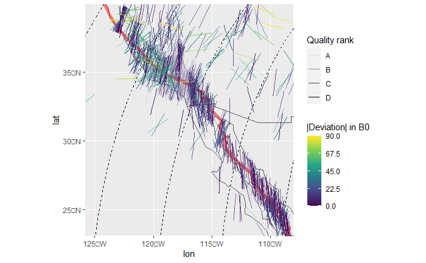

```{r, include = FALSE}
knitr::opts_chunk$set(
  collapse = TRUE,
  comment = "#>"
)
```

This vignette teaches you how to handle large stress datasets and how to 
retrieve relative plate motions parameters from a set of plate motions. 

```{r setup, echo=TRUE}
library(tectonicr)
library(ggplot2) # load ggplot library
```

## Larger Data Sets

**tectonicr** also handles larger data sets. A subset of the World Stress Map 
data compilation (Heidbach et al. 2016)
is included as an example data set and can be imported through:

```{r load_wsm2016, echo=TRUE}
data("san_andreas")
head(san_andreas)
```

Modeling the stress directions (wrt. to the geographic North pole) using the 
Euler pole of the motion of North America relative to the Pacific Pate.
We test the dataset against a right-laterally tangential displacement type.
```{r san_andreas, echo=TRUE}
data("nuvel1")
euler <- subset(nuvel1, nuvel1$plate.rot == "na")
san_andreas.prd <- PoR_shmax(san_andreas, euler, type = "right")
```

Combine the model results with the coordinates of the observed data

```{r san_andreas2, echo=TRUE}
san_andreas.res <- cbind(
  san_andreas,
  san_andreas.prd
)
```

`ggplot2::ggplot()` can be used to visualize the results. The
orientation of the axis can be displayed with the function
`geom_spoke()`. The position argument `position = "center_spoke"` aligns
the marker symbol at the center of the point. The deviation can be color
coded. `deviation_norm()` yields the normalized value of the deviation,
i.e. values between 0 and 90$^{\circ}$.

Also included are the plate boundary geometries after Bird (2003)

```{r plates, echo=TRUE}
data("plates") # load plate boundary data set
```

Alternatively, there is also the NUVEL1 plate boundary model by DeMets et al. (1990)
stored under `data("nuvel1_plates")`.

```{r plot, echo=TRUE, warning=FALSE, message=FALSE, eval=FALSE}
# load some geometries from the rnaturalearth package
world <- rnaturalearth::ne_countries(scale = "small", returnclass = "sf")
trajectories <- eulerpole_loxodromes(x = euler, n = 40, cw = FALSE)

ggplot(san_andreas.res) +
  geom_sf(data = world, alpha = .5) +
  geom_sf(
    data = plates,
    color = "red",
    lwd = 2,
    alpha = .5
  ) +
  geom_sf(
    data = trajectories,
    lty = 2
  ) +
  geom_spoke(
    aes(
      x = lon,
      y = lat,
      radius = 1,
      angle = deg2rad(90 - azi),
      color = deviation_norm(dev),
      alpha = san_andreas$quality
    ),
    position = "center_spoke",
    na.rm = TRUE
  ) +
  scale_color_continuous(
    type = "viridis",
    limits = c(0, 90),
    name = "|Deviation| in B0",
    breaks = seq(0, 90, 22.5)
  ) +
  coord_sf(
    xlim = range(san_andreas.res$lon),
    ylim = range(san_andreas.res$lat),
    expand = FALSE,
    default_crs = "WGS84"
  ) +
  scale_alpha_discrete(name = "Quality rank", range = c(1, 0.1))
```


The map shows generally low deviation of the observed $\sigma_{Hmax}$ directions from the modeled stress direction using counter-clockwise 45$^{\circ}$ loxodromes. 

The *normalized* $\chi^2$ test quantifies the fit between the
modeled $\sigma_{Hmax}$ direction the observed stress direction
considering the reported uncertainties of the measurement.

```{r san_andreas_nchisq, echo=TRUE}
norm_chisq(
  obs = san_andreas.res$azi.PoR,
  prd = san_andreas.res$prd,
  unc = san_andreas.res$unc
)
```

The value is $\leq$ 0.15, indicating a significantly good fit of the
model. Thus, the traction of the transform plate boundary explain the
stress direction of the area.

## Variation of the Direction of the Maximum Horizontal Stress wrt. to the Distance to the Plate Boundary

The direction of the maximum horizontal stress correlates with plate motion 
direction at the plate boundary zone. Towards the plate interior, plate boundary 
forces become weaker and other stress sources will probably dominate.

To visualize the variation of the $\sigma_{Hmax}$ wrt. to the distance to the 
plate boundary, we need to transfer the direction of $\sigma_{Hmax}$ from the
geographic reference system (i.e. azimuth is the deviation of a direction from 
geographic North pole) to the **Pole of Rotation (PoR)** reference system
(i.e. azimuth is the deviation from the Euler pole). 

> The *PoR coordinate reference system* is the oblique transformation of the
geographical coordinate system with the Euler pole coordinates being the the
translation factors.

The azimuth in the *PoR reference system* $\alpha_{PoR}$ is the angular 
difference between the azimuth in geographic reference system $\alpha_{geo}$ 
and the (initial) bearing of the great circle 
that passes through the data point and the Euler pole $\theta$.

To calculate the distance to the plate boundary, both the plate boundary 
geometries and the data points (in geographical coordinates) will be 
transformed in to the *PoR* reference system. 
In the *PoR* system, the distance is the latitudinal or longitudinal difference 
between the data points and the inward/outward or tangential moving plate 
boundaries, respectively. 

This is done with the function `distance_from_pb()`, which returns the angular 
distances.

```{r san_andreas_distance, echo=TRUE}
plate_boundary <- subset(plates, plates$pair == "na-pa")
san_andreas.res$distance <-
  distance_from_pb(
    x = san_andreas.res,
    euler = euler,
    pb = plate_boundary,
    tangential = TRUE
  )
```

Finally, we visualize the the $\sigma_{Hmax}$ direction wrt. to the distance to
the plate boundary:
```{r san.andreas.distanceplot1, warning=FALSE, message=FALSE, eval=FALSE}
ggplot(san_andreas.res, aes(x = distance, y = azi.PoR)) +
  coord_cartesian(ylim = c(0, 180)) +
  labs(x = "Distance from plate boundary (degree)", y = "Azimuth in PoR (degree)") +
  geom_hline(yintercept = c(0, 45, 90, 135, 180), lty = 3) +
  geom_pointrange(
    aes(
      ymin = azi.PoR - unc, ymax = azi.PoR + unc,
      color = san_andreas$regime, alpha = san_andreas$quality
    ),
    size = .25
  ) +
  geom_smooth() +
  scale_y_continuous(
    breaks = seq(-180, 360, 45),
    sec.axis = sec_axis(
      ~.,
      name = NULL,
      breaks = c(0, 45, 90, 135, 180),
      labels = c("Outward", "Tan (L)", "Inward", "Tan (R)", "Outward")
    )
  ) +
  scale_alpha_discrete(name = "Quality rank", range = c(1, 0.1)) +
  scale_color_discrete(name = "Tectonic regime")
```


Close to the here dextral plate boundary, the majority of the stress data have 
a strike-slip fault regime and are oriented around 135$^{\circ}$ wrt. to the Euler 
pole. Thus, the date are parallel to the predicted stress sourced by a 
right-lateral displaced plate boundary. 
Away from the plate boundary, the data becomes more noisy.

> This Azimuth (PoR) vs. distance plot also allows to identify whether a less 
known plate boundary represents a inward, outward, or tangential displaced 
boundary.

The relationship between the azimuth and the distance can be better visualized 
by using the deviation (normalized by the data precision) from the the predicted
stress direction, i.e. the *normalized* $\chi^2$:

```{r san.andreas.distanceplot2, warning=FALSE, message=FALSE, eval=FALSE}
ggplot(san_andreas.res, aes(x = distance, y = nchisq)) +
  coord_cartesian(ylim = c(0, 1)) +
  labs(x = "Distance from plate boundary (degree)", y = expression(Norm ~ chi^2)) +
  geom_hline(yintercept = c(0.15, .33, .7), lty = 3) +
  geom_smooth() +
  geom_point(aes(color = san_andreas$regime)) +
  scale_y_continuous(sec.axis = sec_axis(
    ~.,
    name = NULL,
    breaks = c(.15 / 2, .33, .7 + 0.15),
    labels = c("Good fit", "Random", "Systematic\nmisfit")
  )) +
  scale_color_discrete(name = "Tectonic regime")
```


We can see that the data in fact starts to scatter notably 
beyond a distance of 4$^{\circ}$ and becomes random at ca. 8$^{\circ}$ away from the plate 
boundary. 
Thus, the North American-Pacific plate boundary zone at the San Andreas Fault is 
approx. 4--6$^{\circ}$ (ca. 440--670 km) wide. 

> The *normalized* $\chi^2$ vs. distance plot allows to specify the width of the
plate boundary zone.


# Quick analysis
A quick analysis including visualization of the results can be obtained by
```{r quick, warning=FALSE, message=FALSE, eval=FALSE}
stress_analysis(san_andreas, euler, "right", plate_boundary, plot = TRUE)
```

# References

Bird, Peter. 2003. “An Updated Digital Model of Plate Boundaries.” *Geochemistry, Geophysics, Geosystems* 4 (3). https://doi.org/10.1029/2001gc000252.

DeMets, C., R. G. Gordon, D. F. Argus, and S. Stein. 1990. “Current Plate Motions.” *Geophysical Journal International* 101 (2): 425–78. https://doi.org/10.1111/j.1365-246x.1990.tb06579.x.

Heidbach, Oliver, Mojtaba Rajabi, Karsten Reiter, Moritz Ziegler, and WSM Team. 2016. “World Stress Map Database Release 2016. V. 1.1.” GFZ Data Services. https://doi.org/10.5880/WSM.2016.001.
