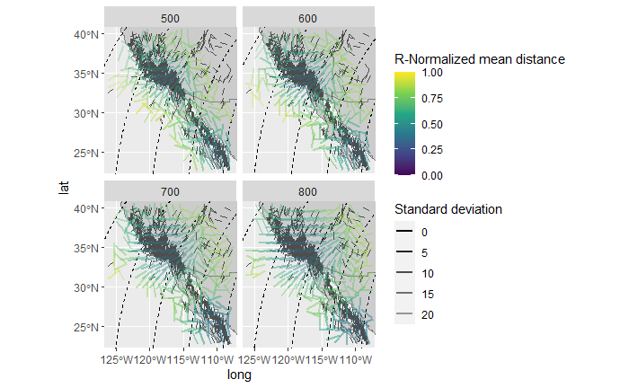
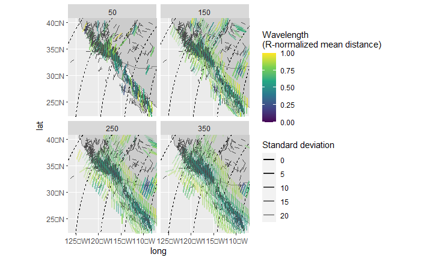

```{r, include = FALSE}
knitr::opts_chunk$set(
  collapse = TRUE,
  comment = "#>"
)
```

This vignette teaches you how to spatially interpolate stress fields and 
display the lateral patterns of stress anomalies.

```{r setup, echo=TRUE}
library(tectonicr)
library(ggplot2) # load ggplot library
```

```{r load_data, echo=TRUE}
data("san_andreas")

data("cpm_models")
por <- cpm_models |>
  subset(model == "NNR-MORVEL56") |>
  equivalent_rotation("na", "pa")
```


## Interpolation
### Geographic coordinate system
Spatial interpolation of stress data is based on the aforementioned metrics (the
algorithm is a modified version of the MATLAB script 'stress2grid' by Ziegler 
and Heidbach (2017).

```{r interpolation, echo=TRUE}
mean_SH <- stress2grid(san_andreas, gridsize = 1, R_range = seq(50, 350, 100))
```

The default settings apply quality and inverse distance weighting of the mean, 
as well as a 25% cut-off for the standard deviation. 

The data can now be visualized:  
```{r plot, echo=TRUE, warning=FALSE, message=FALSE, eval=FALSE}
trajectories <- eulerpole_loxodromes(x = por, n = 40, cw = FALSE)
ggplot(mean_SH) +
  borders(fill = "grey80") +
  geom_sf(data = trajectories, lty = 2) +
  geom_spoke(data = san_andreas, aes(lon, lat, angle = deg2rad(90 - azi)), radius = .5, color = "grey30", position = "center_spoke") +
  geom_spoke(aes(lon, lat, angle = deg2rad(90 - azi), alpha = sd, color = mdr), radius = 1, position = "center_spoke", lwd = 1) +
  coord_sf(xlim = range(san_andreas$lon), ylim = range(san_andreas$lat)) +
  scale_alpha(name = "Standard deviation", range = c(1, .25)) +
  scale_color_viridis_c(
    "Wavelength\n(R-normalized mean distance)",
    limits = c(0, 1),
    breaks = seq(0, 1, .25)
  ) +
  facet_wrap(~R)
```


### PoR coordinate system

The interpolated direction of far apart data points will suffer from distortions
due to the underlying projection. In order to prevent such effects, the 
interpolation can be done in the PoR reference frame where the direction stays 
constant no matter the distance between the data points. Assuming that the 
stress field is sourced by the plate boundary force, the model-based 
interpolation allows more reliable results for areas close to plate boundaries.

```{r interpolation_PoR, eval=TRUE}
mean_SH_PoR <- PoR_stress2grid(san_andreas, PoR = por, gridsize = 1, R_range = seq(50, 350, 100))
```

```{r plot2, echo=TRUE, warning=FALSE, message=FALSE, eval=FALSE}
ggplot(mean_SH_PoR) +
  borders(fill = "grey80") +
  geom_sf(data = trajectories, lty = 2) +
  geom_spoke(data = san_andreas, aes(lon, lat, angle = deg2rad(90 - azi)), radius = .5, color = "grey30", position = "center_spoke") +
  geom_spoke(aes(lon, lat, angle = deg2rad(90 - azi), alpha = sd, color = mdr), radius = 1, position = "center_spoke", lwd = 1) +
  coord_sf(xlim = range(san_andreas$lon), ylim = range(san_andreas$lat)) +
  scale_alpha(name = "Standard deviation", range = c(1, .25)) +
  scale_color_viridis_c(
    "Wavelength\n(R-normalized mean distance)",
    limits = c(0, 1),
    breaks = seq(0, 1, .25)
  ) +
  facet_wrap(~R)
```


## Rasterize the interpolation

The function `compact_grid()` selects only data with the minimum search radius 
from interpolated layers with different search radii. Since the interpolation 
was performed in the PoR CRS, the interpolated azimuths are additionally given 
in the transformed azimuths. This allows to easily calculate misfits from 
predicted directions:

```{r compact, echo = TRUE}
mean_SH_PoR_reduced <- mean_SH_PoR |>
  compact_grid() |>
  dplyr::mutate(cdist = circular_distance(azi.PoR, 135))
```

Using `circular_distance()` in the example above, we can display the spatial 
patterns of the misfits of the stress direction from the predicted direction of 
the plate boundary force. Since the interpolation was performed in the PoR CRS, 
the grid is not composed of equally spaced grid cells in the geographic CRS. To 
rasterize such grids, we can, e.g., use Voronoi cells from the `ggforce` 
package.

```{r voronoi, echo=TRUE, warning=FALSE, message=FALSE, eval=FALSE}
ggplot(mean_SH_PoR_reduced) +
  ggforce::geom_voronoi_tile(
    aes(lon, lat, fill = cdist),
    max.radius = .7, normalize = FALSE
  ) +
  scale_fill_viridis_c("Angular distance", limits = c(0, 1)) +
  borders(colour = "grey80", fill = NA) +
  geom_sf(data = trajectories, lty = 2) +
  geom_spoke(
    aes(lon, lat, angle = deg2rad(90 - azi), alpha = sd),
    radius = .5, position = "center_spoke", lwd = .2, colour = "white"
  ) +
  scale_alpha("Standard deviation", range = c(1, .25)) +
  coord_sf(xlim = range(san_andreas$lon), ylim = range(san_andreas$lat))
```

The map highlights **stress anomalies** which show misfits to the direction of 
tested plate boundary force.

## Kernel dispersion

Another way to analyse spatial misfits is the kernel dispersion, i.e. the
local dispersion within a user-defined window (kernel). The kernel´s half width 
can be a single number (km) or a range of widths. The latter requires to compact
the grid result (`x`) to find the smallest kernel size containing the the smallest 
dispersion (`compact_grid(x, 'dispersion')`).

> It is recommended to calculate the kernel dispersion on PoR transformed data to 
avoid angle distortions due to projections.

```{r kernel_disp,, echo=TRUE, warning=FALSE, message=FALSE, eval=FALSE}
san_andreas_por <- san_andreas 
san_andreas_por$azi <- PoR_shmax(san_andreas, por, "right")$azi.PoR
san_andreas_por$prd <- 135
san_andreas_kdisp <- kernel_dispersion(san_andreas_por, gridsize = 1, R_range = seq(50, 350, 100)) |> 
  compact_grid('dispersion')

ggplot(san_andreas_kdisp) +
  ggforce::geom_voronoi_tile(
    aes(lon, lat, fill = stat),
    max.radius = .7, normalize = FALSE
  ) +
  scale_fill_viridis_c("Angular distance", limits = c(0, 1)) +
  borders(colour = "grey80", fill = NA) +
  geom_sf(data = trajectories, lty = 2) +
  geom_spoke(data  = san_andreas,
    aes(lon, lat, angle = deg2rad(90 - azi), alpha = unc),
    radius = .5, position = "center_spoke", lwd = .2, colour = "white"
  ) +
  scale_alpha("Standard deviation", range = c(1, .25)) +
  coord_sf(xlim = range(san_andreas$lon), ylim = range(san_andreas$lat))
```


# References
Mardia, K. V., and Jupp, P. E. (Eds.). (1999). "Directional Statistics" 
Hoboken, NJ, USA: John Wiley & Sons, Inc. 
doi: 10.1002/9780470316979.
<!--doi: [10.1002/9780470316979](https://doi.org/10.1002/9780470316979).-->

Ziegler, Moritz O., and Oliver Heidbach. 2017. “Manual of the Matlab Script Stress2Grid” 
GFZ German Research Centre for Geosciences; World Stress Map Technical Report 17-02. 
doi: [10.5880/wsm.2017.002](https://doi.org/10.5880/wsm.2017.002). 
