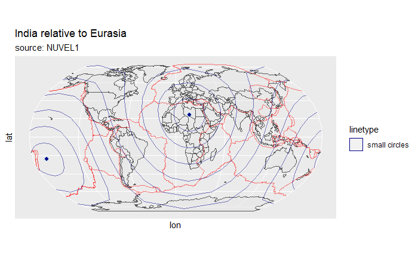
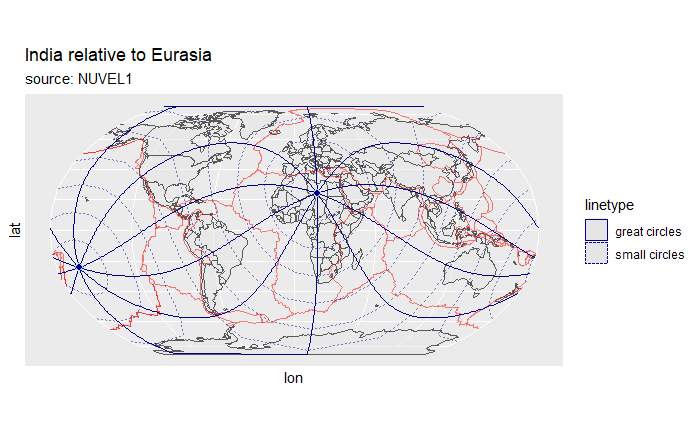
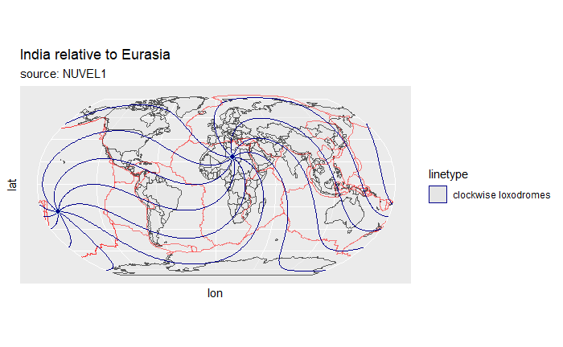

```{r, include = FALSE}
knitr::opts_chunk$set(
  collapse = TRUE,
  comment = "#>"
)
```

**PlateTectonicStressR** is a free and open-source R package for modeling and analyzing the
direction of the maximum horizontal stress based on the empirical link
between the orientation of intraplate stress and the direction of the
relative motion of neighboring plates.

# Theory

The theory of intraplate tectonics 
([Wdowinski 1998](http://dx.doi.org/10.1029/97JB03390)) allows for
calculating the first-order intraplate deformation induced by horizontal
displacement of deformable plate boundaries. It is based on empirical
link between the directions of relative plate motion and the
displacement and deformation fields within a plate interior adjacent to
three types of deformable plate boundaries: inward-, outward-, and
tangential-displaced boundaries. The model predicts the direction of
intraplate displacement, displacement rate, strain, and stress fields in
terms of small circles, great circles, and 45$^{\circ}$ loxodromes around the
pole of rotation of two adjacent plates. According to the theory, the principal 
axis of the maximum horizontal stress follows small circles for inward-displaced
boundaries, great circles for outward-displaced boundaries, and
loxodromes for tangential-displaced boundaries.

The theory assumes that the first-order intraplate deformation is
predominantly induced by horizontal forces acting on plate boundaries
and by buoyancy forces that arise from lateral density variations
between mid-ocean ridges and plate interiors (ridge push).

## Inward, Outward and Tangential Displaced Boundaries

**Inward-moving plate boundaries** induce compressional horizontal
tractions from the plate boundary towards the plate's interior along the
direction of relative plate motion. These compressional tractions are
produced by forces related to subduction, collision, or ridge-push.
Thus, stresses across convergent plate boundaries are characterized by
the dominance of thrusting or strike-slip faulting
($\sigma_1 \approx \sigma_{Hmax}$) with $\sigma_{Hmax}$ (maximum
horizontal stress) trending parallel to the plate convergence, i.e.
parallel to *small circles* around the Euler pole of the relative plate
motion.

**Outward moving plate boundaries** produce tensional tractions and
displacements directed away from the plate interior. Along spreading
ridges and intracontinental rifting stresses are dominated by normal
faulting ($\sigma_1 \approx \sigma_{vertical}$,
$\sigma_2 \approx \sigma_{Hmax}$) with $\sigma_{Hmax}$ trending
perpendicular to the plate motion trajectories (i.e. along
*great circles*). In the case of intracontinental setting, stresses and
displacements may be associated to slab-retreat, back-arc extension, or
the release of the excess of gravitational potential energy stored in
thickened crust through, e.g., gravitational collapse.

Along transform boundaries (**tangential displaced boundaries**), the
two neighboring plates exert shear tractions tangential to the
orientation of the boundary ([Forsyth and Uyeda, 1975](https://academic.oup.com/gji/article-lookup/doi/10.1111/j.1365-246X.1975.tb00631.x)). Faulting and displacement adjacent to these plate boundaries are characterized 
by strike-slip parallel to the plate motion, and thus, the principal axes
of maximum and minimum stress are orientated at an angle of c. 45$^{\circ}$ to
the plate motion trajectory. 
Geometrically, $\sigma_{Hmax}$
orientation follows along 45$^{\circ}$ *loxodromes* (lines of constant bearing) 
which diverge ---depending on the sense of the transform boundary--- clockwise 
or counterclockwise from the relative Euler pole and intersect both small and 
great circles at an angle of 45$^{\circ}$.

## Theoretical direction of Horizontal Stress and Deviation From the Measured Stress

**PlateTectonicStressR** basically calculates the bearing from a point of 
interest to a given Euler pole of the relative plate motion by the formula:

```{=tex}
\begin{equation} 
  \theta = \arctan2 (\sin \Delta\lambda * \cos\psi_2, \cos\psi_1 \sin\psi_1-\sin\psi_1 \cos\psi_2 \cos\Delta\lambda)
\end{equation}
```

where $\psi_1$, $\lambda_1$ are the longitude and latitude of the point, 
$\psi_2$, $\lambda_2$ the longitude and latitude of the Euler pole 
($\Delta\lambda$ is the difference in longitude). 

> The bearing $\theta$ is the orientation of a great circle that passes through 
the point and the Euler pole. Thus, it reflects the theoretical direction of 
$\sigma_{Hmax}$ that follows great circles trajectories. 
Small circle directions then are $90^{\circ}$ and loxodrome directions 
are $\pm45^{\circ}$ to $\theta$.

---

In **PlateTectonicStressR**, these directions can modeled by the following 
steps:

First, load the package:

```{r setup, echo=TRUE}
library(PlateTectonicStressR)
library(ggplot2) # load ggplot library
```

Next, we need to specify coordinates of the Euler pole to get the directions of 
the great circles, small circles, and loxodromes around the Euler pole at the 
given point (e.g. at 45$^{\circ}$N/20$^{\circ}$E). 

For example, the Euler pole has the coordinates: 90$^{\circ}$N/0$^{\circ}$E. 
Then $\sigma_{Hmax}$ following great and small circles and loxodromes
geometries can be modeled with `model_shmax()`:

```{r direction_of_plate_motion, echo=TRUE}
# Example:
point <- data.frame(lat = 45, lon = 20)
euler <- data.frame(lat = 90, lon = 0)
model <- model_shmax(point, euler)
print(model)
```

If there is an observed stress orientation at the point, e.g. azimuth of
$\sigma_{Hmax}$ is 90$^{\circ}$, the deviation from the modeled stress
orientations can be achieved via `misfit_shmax()`:

```{r deviation_of_plate_motion, echo=TRUE}
deviation <- misfit_shmax(model, 90)
print(deviation)
```

## Quantitative Comparison Between Predicted and Observed Maximum Horizontal Stress

The **normalized** $\chi^2$ test quantitatively compares the predicted
(`model_shmax()`) and observed $\sigma_{Hmax}$ azimuth relative to the reported
$\sigma$ standard deviation (Wdowinski 1999).

```{=tex}
\begin{equation} 
  \textrm{Norm} \chi^2_i = 
 \frac{\sum_{i=1}^{n} \left(\frac{\alpha_i - \alpha_{predict}}{\sigma_i}\right)^2}
 {\sum_{i=1}^{n} \left(\frac{90}{\sigma_i}\right)^2} \end{equation}
```
with $\alpha_i$ and $\alpha_{predicted}$ are the observed and predicted
directions of $\sigma_{Hmax}$ with respect to the pole of rotation,respectively.
The $\sigma_i$ parameter is the reported uncertainty of the observed
azimuth and $M$ is the number of observations that are used in each
test.

The normalized $\chi^2$ test yields a number in the range between 0-1
which indicates the quality of the fit. Low values of the normalized
$\chi^2$ test ($\leq$ 0.15 indicate good agreement between predicted and
observed directions. High values ($>$ 0.7) indicate a systematic misfit
between predicted and observed directions of about 90$^{\circ}$. Random
distribution of $\sigma_{Hmax}$ directions results in Norm $\chi^2 = 0.33$

The test can be run using `norm_chi2(obs, prd, unc)`. `obs` is a numeric
vector with the observed $\sigma_{Hmax}$; `prd` is a vector with the predicted $\sigma_{Hmax}$
(vector must be of length of `obs`); and `unc` is the uncertainty of
observed $\sigma_{Hmax}$ (either numeric vector of length of `obs` or a number).

```{r shmax_test, echo=TRUE}
data("nuvel1") # import example data set for Euler roations
euler <-
  subset(nuvel1, nuvel1$plate.rot == "na") # North America relative to Pacific plate
point <- data.frame(lat = 45, lon = 20)

prd <- model_shmax(point, euler)
norm_chi2(obs = 90, prd$sc, unc = 10)
```
The plate motions relative to the Pacific plate according to the 
[NUVEL-1A](https://doi.org/10.1029/91GL01532) model are included in the package
and can be imported through:

```{r nuvel1, eval=FALSE, include=TRUE}
data("nuvel1")
```


## Larger Data Sets

**PlateTectonicStressR** also handles larger data sets. The 
[World Stress map (WSM2016)](http://www.world-stress-map.org/) data compilation
is included as an example data set and can be imported through:

```{r load_wsm2016, echo=TRUE}
data("wsm2016")
head(wsm2016)
```

Subset of the WSM data to stress data relevant for the Plate boundary
between North America and the Pacific plate at the San Andreas fault:

```{r wsm_subset, echo=TRUE}
california <- subset(
  wsm2016,
  wsm2016$lat >= 23 & wsm2016$lat <= 40 &
    wsm2016$lon >= -126 & wsm2016$lon <= -108
)
```

Modeling the stress directions (wrt to the geographic North pole) using the 
Euler pole of the motion of North America relative to the Pacific Pate.

```{r san_andreas, echo=TRUE}
euler <- subset(nuvel1, nuvel1$plate.rot == "na")

california.prd <- model_shmax(california, euler)
california.deviation <- misfit_shmax(california.prd, california$azi)
```

Combine the model results with the coordinates of the observed data

```{r san_andreas2, echo=TRUE}
california.res <- cbind(
  lat = california$lat,
  lon = california$lon,
  azi = california$azi,
  california.prd,
  california.deviation
)
```

`ggplot2::ggplot()` can be used to visualize the results. The
orientation of the axis can be displayed with the function
`geom_spoke()`. The position argument `position = "center_spoke"` aligns
the marker symbol at the center of the point. The deviation can be color
coded. `deviation_norm()` yields the normalized value of the deviation,
i.e. values between 0 and 90$^{\circ}$.

Also included are the plate boundary geometries after 
[Bird (2003)](http://doi.wiley.com/10.1029/2001GC000252): 

```{r plates, echo=TRUE}
data("PB2002") # load plate boundary data set
```

```{r plot, echo=TRUE, warning=FALSE, message=FALSE}
# load some geometries from the rnaturalearth package
world <- rnaturalearth::ne_countries(scale = "small", returnclass = "sf") 

ggplot(california.res) +
  geom_sf(data = world, alpha =.5) +
  geom_sf(
    data = PB2002,
    color = "red",
    lwd = 2,
    alpha = .5
  ) +
  geom_spoke(
    aes(
      x = lon,
      y = lat,
      radius = 1,
      angle = deg2rad(-azi + 90),
      color = deviation_norm(dev.ld.ccw)
    ),
    position = "center_spoke",
    na.rm = TRUE
  ) +
  scale_color_continuous(
    type = "viridis",
    limits = c(0, 90),
    name = "|Deviation| in °",
    breaks = seq(0, 90, 22.5)
  ) +
  coord_sf(
    xlim = range(california.res$lon),
    ylim = range(california.res$lat),
    expand = FALSE, 
    default_crs = "WGS84"
  ) 
```

The map shows generally low deviation of the observed $\sigma_{Hmax}$
directions from the modeled stress direction using counter-clockwise 
45$^{\circ}$ loxodromes. 

The *normalized* $\chi^2$ test quantifies the fit between the
modeled $\sigma_{Hmax}$ orientation the observed stress direction
considering the reported uncertainties of the measurement.

First, we need to complete the uncertainties of the WSM database in case of 
missing values:
```{r san_andreas_unc, echo=TRUE}
# convert the WSM quality ranking into the standard deviation of the measurement
california.res$unc <- ifelse(
  is.na(california$sd), 
  quantise_wsm_quality(california$quality), 
  california$sd
)
```

```{r san_andreas_nchi2}
norm_chi2(
  obs = california$azi,
  prd = california.prd$ld.ccw,
  unc = california.res$unc
)
```

The value is $\leq$ 0.15, indicating a significantly good fit of the
model. Thus, the traction of the transform plate boundary explain the
stress direction of the area.

### Variation of the Orientation of the Maximum Horizontal Stress wrt to the Distance to the Plate Boundary

The orientation of the maximum horizontal stress correlates with plate motion 
direction at the plate boundary zone. Towards the plate interior, plate boundary 
forces become weaker and other stress sources will probably dominate.

To visualize the variation of the $\sigma_{Hmax}$ wrt to the distance to the 
plate boundary, we need to transfer the orientation of $\sigma_{Hmax}$ from the
geographic reference system (i.e. azimuth is the deviation of a direction from 
geographic North pole) to the **Pole of Rotation (PoR)** reference system
(i.e. azimuth is the deviation from the Euler pole). 

> The *PoR coordinate reference system* is the oblique transformation of the
geographical coordinate system with the Euler pole coordinates being the the
translation factors.

The azimuth in the *PoR reference system* $\alpha_{PoR}$ is the angular 
difference between the azimuth in geographic reference system $\alpha_{geo}$ 
and the (initial) bearing of the great circle 
that passes through the data point and the Euler pole $\theta$:

```{=tex}
\begin{equation} 
  \alpha_{PoR} = \alpha_{geo} - \theta
\end{equation}
```

The function `PoR_shmax()` returns the transformed azimuth of $\sigma_{Hmax}$ 
and, if given, the deviation from the predicted $\sigma_{Hmax}$ orientation 
related to the plate boundary type:

```{r san_andreas_por, echo=TRUE}
california.res <- cbind(california.res,
                        PoR_shmax(california.res, euler, type = "right"))
```

To calculate the distance to the plate boundary, both the plate boundary 
geometries and the data points (in geographical coordinates() will be 
transformed in to the *PoR* reference system. 
In the *PoR* system, the distance is the latitudinal or longitudinal difference 
between the data points and the inward/outward or tangential moving plate 
boundaries, respectively. 

This is done with the function `distance_from_pb()`, which returns the angular 
distances.

```{r san_andreas_distance, echo=TRUE}
san_andreas <- subset(PB2002,
                      PB2002$PlateA %in% c("NA" , "PA") &
                        PB2002$PlateB %in% c("NA", "PA"))

california_sf <-
  sf::st_set_crs(sf::st_as_sf(california, coords = c("lon", "lat")), "WGS84")

california.res$distance <-
  distance_from_pb(
    x = california_sf,
    ep = euler,
    pb = san_andreas,
    tangential = TRUE
  )
```

Finally, we visualize the the $\sigma_{Hmax}$ orientation wrt to the distance to
the plate boundary:
```{r san.andreas.distanceplot1, warning=FALSE, message=FALSE}
ggplot(california.res,
       aes(
         x = distance,
         y = azi.PoR,
         color = california$regime
       )) +
  labs(x = "Distance from plate boundary (°)", y = "Azimuth in PoR (°)") +
  geom_hline(yintercept = c(0, 45, 90, 135, 180), lty = 3) +
  geom_pointrange(aes(ymin = azi.PoR - unc, ymax = azi.PoR + unc)) +
  scale_y_continuous(
    breaks = seq(-180, 360, 45),
    sec.axis = sec_axis(
      ~ .,
      name = NULL,
      breaks = c(0, 45, 90, 135, 180),
      labels = c("Outward", 'Tan (L)', "Inward", "Tan (R)", "Outward")
    )
  )
```

Close to the here dextral plate boundary, the majority of the stress data have 
a strike-slip fault regime and are oriented around 135° wrt to the Euler 
pole. Thus, the date are parallel to the predicted stress sourced by a 
right-lateral displaced plate boundary. 
Away from the plate boundary, the data becomes more noisy.

> This Azimuth (PoR) vs. distance plot also allows to identify wether a less 
known plate boundary represents a inward, outward, or tangetial displaced 
boundary.

The relationship between the azimuth and the distance can be better visualized 
by using the deviation (normalized by the data precision) from the the predicted
stress orientation, i.e. the *normalized* $\chi^2$:

```{r san.andreas.distanceplot2, warning=FALSE, message=FALSE}
ggplot(california.res, aes(x = distance, y = nchi2)) +
  coord_cartesian(ylim = c(0, 1)) +
  labs(x = "Distance from plate boundary (°)", y = expression(Norm~chi^2)) +
  geom_hline(yintercept = c(0.15, .33, .7), lty = 3) +
  geom_smooth() +
  geom_point(aes(color = california$regime)) +
  scale_y_continuous(sec.axis = sec_axis(
    ~ .,
    name = NULL,
    breaks = c(.15 / 2, .33, .7 + 0.15),
    labels = c("Good fit", 'Random', "Systematic\nmisfit")
  ))
```

We can see that the data in fact starts to scatter more randomly 
beyond a distance of 4° and becomes totally random at ca. 8° away from the plate 
boundary. 
Thus, the North American-Pacific plate boundary zone at the San Andreas Fault is 
approx. 4--6° (ca. 440--670 km) wide. 

> The *normalized* $\chi^2$ vs. distance plot allows to specify the width of the
plate boundary zone.

## Equivalent rotations

Relative plate motions from a set of (global) plate motions can be retrieved by 
transforming the set of the Euler rotations parameters to equivalent rotations.

The NUVEL1 data set offers the global plate motions relative to the Pacific 
plate. In order to extract the plate motions between two other plates 
(e.g. all plates relative to Eurasia), one has to transform the rotations in to 
a new, equivalent reference system (i.e. all rotation with respect to Eurasia). 

In **PlateTectonicStressR** this can be done with \code{equivalent_rotation}:

```{r nuvel_eq, echo=TRUE}
nuvel1.eu <- equivalent_rotation(nuvel1, fixed = "eu")
head(nuvel1.eu)
```

## Plotting Pole of Rotation Grids

To visualize the theoretical trajectories of the orientation of $\sigma_{Hmax}$ 
(great circles, small circles, and loxodomes), we need to transform the 
locations from the geographical coordinate system into the *PoR* coordinate 
system. The transformations are done through the function functions 
`geographical_to_PoR()` and `PoR_to_geographical()`. They are the base of the 
functions `eulerpole_smallcircles()`, `eulerpole_greatcircles()`, and 
`eulerpole_loxodromes()` that allow to draw the theoretical trajectories in
geographical coordinates.

### Small Circles

Function `eulerpole_smallcircles(x, gridsize)` returns Small circles as as 
simple feature(`sf`) by giving a `data.frame` of the Euler pole
coordinates in lat and lon (`x`) and the number of small circles (`n`).

For example the small circles around the Euler pole of the relative
motion of the Indian plate relative to the Eurasian plate (transformed from the 
from the NUVEL1 model).

```{r nuvel_euin, echo=TRUE}
euler <-
  subset(nuvel1.eu, nuvel1$plate.rot == "in") # India relative to Eurasia
```

The `returnclass` option in `eulerpole_smallcircles()` provides the output 
types `"sf"` (for a simple feature) and `"sp"` (`Spatial*` object) for the
small circles. 

To eventually plot the small circles with `ggplot`, I recommend to extract a 
`sf` feature and plot the it with `geom_sf()`: 

```{r small_circles_around_ep, eval=FALSE, include=TRUE}
euler.sm <- eulerpole_smallcircles(euler)

ggplot() +
  geom_sf(data = world, alpha =.5) +
  geom_sf(
    data = PB2002,
    color = "red",
    alpha = .5
  ) +
  labs(title = "India relative to Eurasia", subtitle = "source: NUVEL1") +
 geom_sf(
    data = euler.sm, 
    aes(lty = "small circles"),
    color = "darkblue", fill = NA,
    alpha = .5
  ) +
  geom_point(
    data = euler,
    aes(lon, lat),
    shape = 21,
    colour = "lightblue",
    size = 2,
    fill = "darkblue",
    stroke = 1
  ) +
  geom_point(
    data = euler,
    aes(lon + 180, -lat),
    shape = 21,
    colour = "lightblue",
    size = 2,
    fill = "darkblue",
    stroke = 1
  ) +
  coord_sf(default_crs = "WGS84", crs = sf::st_crs("+proj=natearth")) 
```




### Great Circles

Great circles are lines that cut the small circles at 90$^{\circ}$ and
the Euler pole. Function `eulerpole_greatcircles(x, n)` returns great
circles as `sf` object by giving a `data.frame` of the Euler
pole coordinates in lat and lon (`x`) and the number of great circles `n`,
or the great circle angles (`360/d`).

```{r great_circles_around_ep, eval=FALSE, include=TRUE}
euler.gm <- eulerpole_greatcircles(euler)

ggplot() +
  geom_sf(data = world, alpha =.5) +
  geom_sf(
    data = PB2002,
    color = "red",
    alpha = .5
  ) +
  labs(title = "India relative to Eurasia", subtitle = "source: NUVEL1") +
 geom_sf(
    data = euler.sm, 
    aes(lty = "small circles"),
    color = "darkblue",
    alpha = .5
  ) +
  geom_sf(
    data = euler.gm, 
    aes(lty = "great circles"),
    color = "darkblue"
  ) +
  geom_point(
    data = euler,
    aes(lon, lat),
    shape = 21,
    colour = "lightblue",
    size = 2,
    fill = "darkblue",
    stroke = 1
  ) +
  geom_point(
    data = euler,
    aes(lon + 180, -lat),
    shape = 21,
    colour = "lightblue",
    size = 2,
    fill = "darkblue",
    stroke = 1
  ) +
  coord_sf(default_crs = "WGS84", crs = sf::st_crs("+proj=natearth")) 
```



### Loxodromes

Loxodrome (also called Rhumb Line) is a curve cutting the small circles
at a constant angle. Thus, small and great circles are 0$^{\circ}$ and
90$^{\circ}$ loxodromes, respectively.

Function `eulerpole_loxodromes(x, n)` returns loxodromes as
`sf` object by giving a `data.frame` of the Euler pole
coordinates in lat and lon (`x`) and the angle between the loxodromes, the
direction, and the sense.

```{r loxodromes, eval=FALSE, include=TRUE}
euler.ld <- eulerpole_loxodromes(x = euler, angle = 45, n = 10, sense = "sinistral")

ggplot() +
  labs(title = "India relative to Eurasia", subtitle = "source: NUVEL1") +
  geom_sf(data = world, alpha =.5) +
  geom_sf(
    data = PB2002,
    color = "red",
    alpha = .5
  ) +
  geom_sf(
    data = euler.ld, 
    aes(lty = "clockwise loxodromes"),
    color = "darkblue"
  ) +
  geom_point(
    data = euler,
    aes(lon, lat),
    shape = 21,
    colour = "lightblue",
    size = 2,
    fill = "darkblue",
    stroke = 1
  ) +
  geom_point(
    data = euler,
    aes(lon + 180, -lat),
    shape = 21,
    colour = "lightblue",
    size = 2,
    fill = "darkblue",
    stroke = 1
  ) +
  coord_sf(default_crs = "WGS84", crs = sf::st_crs("+proj=natearth")) 
```



